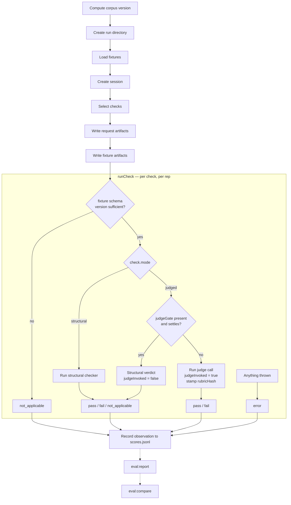

# Eval Harness

## Notes

- **A missing structural check results in a compile-time error, not a run-time error.** In `apps/zoltar-be/eval/checks/run-check.ts`, `structuralCheckers` is declared as `Record<StructuralTag, ...>` where `StructuralTag = (typeof structuralFailureModeTags)[number]` (`eval/checks/structural/registry.ts:14,21`). A missing entry is a compile error, not an absent key. 
- An error thrown in `runCheck` surfaces as an `error` results, never a `fail`. Tests that produce errors are not counted in the denominator for a given check. Catching errors keeps the whole harness run from failing and needing to be restarted.
- `not_applicable` and `error` are outcomes, handled differently from `pass` and `fail`. `not_applicable` and `error` are excluded from the denominator when calculating pass rate. They show up in the reports as applicability rate. A rate of 1.00 with low applicability is much more suspect than one with high applicability. 
- The eval harness ends at recording `scores.jsonl`. `eval:report` and `eval:compare` are separate commands.
- `judgedInvoked` exists to track which judged checks were excluded by the gate and which actually went to the judge, which is an important distinction when running `eval:judge-variance`. Gated reps have frozen deterministic inputs, so they'd contribute guaranteed non-flips to the denominator and deflate the measured flip rate of the rubric under validation. Similarly, `rubricHash` is stamped only when a rubric actually graded the rep, which is why it's optional.
