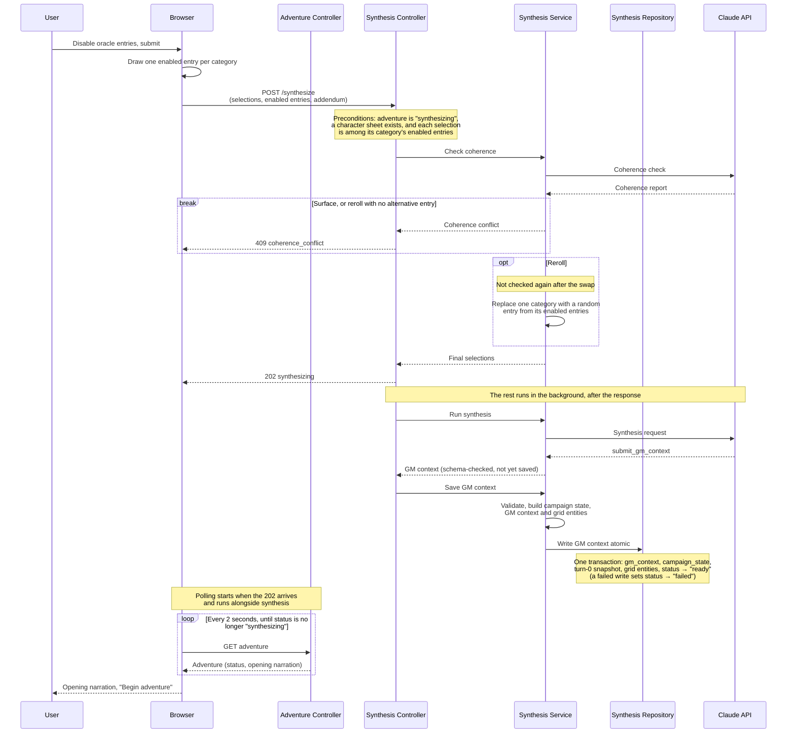

# Adventure Synthesis

Creating a new adventure can only start once a campaign and a character exist. With those two pieces in place, the player can initiate a new adventure. On the oracle screen, the player can disable any options they don't want to make available to Claude in composing the adventure. Each oracle option includes a descriptive text that the player sees and a more detailed instruction for Claude.

Once the oracle options are submitted, the browser selects one entry from each category from among the options that the player enabled. The browser sends three things to `POST /synthesize`: the drawn selections, the full list of enabled entries (`activeEntryIds`), and an optional free-text addendum from the player. This addendum is used to provide additional instructions to the synthesis prompt during development and playtesting; it will be disabled in production. 

There is an initial coherence check that runs, just to make sure all of the selected options work together without any contradictions. The coherence check has three outcomes:

- **Proceed:** no conflict, carry on.
- **Reroll:** swap one category silently. Claude names the category, and the back-end then picks a random replacement from the entries the player left enabled. The swapped set is *not* checked again.
- **Surface:** the conflict goes back to the player as a 409 with a description. This also happens when a reroll is asked for but no alternative entry exists.

Once the coherence check passes, Claude synthesizes the adventure. Synthesis runs in the background. The endpoint returns 202 as soon as the coherence check passes, and the browser polls the adventure's status every two seconds. 

The synthesis call uses its own prompt (different from the Warden prompt used during play) and tool `submit_gm_context`. Claude's output is saved in one transaction as the adventure's GM context, the starting campaign state, the grid entities, and the turn-0 snapshot, and the adventure's status becomes `ready`. If the write fails, the status becomes `failed`.

The GM context from the synthesis output feeds directly into the GM context for the adventure and includes locations, threats, NPC agendas, flags, and so on. It also includes the opening narration, which is presented to the player before they take their first turn. It gives the player something to respond to for their first turn rather than just dumping them into the adventure without any kind of introduction.  
