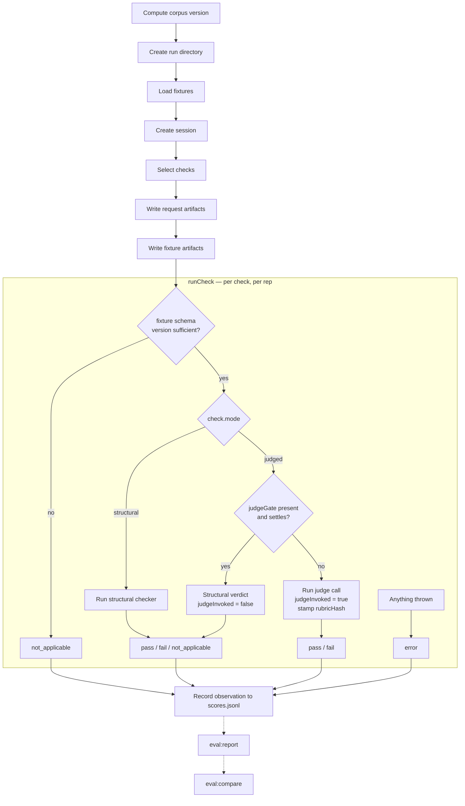

# Eval Harness

## Notes

- **A missing structural check is a compile-time error, not a run-time one.** In `../../apps/zoltar-be/eval/checks/run-check.ts`, `structuralCheckers` is declared as `Record<StructuralTag, ...>` where `StructuralTag = (typeof structuralFailureModeTags)[number]` (`eval/checks/structural/registry.ts:14,21`). A missing entry fails the build; the `as keyof typeof` lookup in `runCheck` therefore cannot produce `undefined`.
- **The two gates are unrelated.** The fixture-schema gate runs before mode dispatch and applies to both modes — it means the check postdates the fixture (`requiresFixtureSchema` exceeds the fixture's `fixtureSchemaVersion`). `judgeGate` applies only to judged checks and is a structural pre-filter: anything structure can settle is settled deterministically and for free, so only the semantic residual reaches the rubric.
- **Anything thrown becomes `error`, never `fail`.** The whole dispatch runs inside a try/catch, so a `JudgeOutputError`, an Anthropic API failure, or a checker rejecting a malformed fixture all produce an `error` row and the run continues. A transient API failure is therefore never indistinguishable from a real regression, and a single bad rep doesn't abort a run mid-flight.
- **Four verdicts, and only two are scored.** `not_applicable` and `error` are excluded from the pass-rate denominator; reports surface them as applicability rate. Read the two together — a pass rate of 1.00 over low applicability is far more suspect than the same rate over high applicability, since a check that almost never applies looks identical to one that genuinely passes.
- **`judgeInvoked` records whether a rubric actually ran.** It's false for structural checks and for judged checks the gate settled. `eval:judge-variance` needs this: gated reps have frozen, deterministic inputs, so re-running one N times yields N identical answers — guaranteed non-flips that would deflate the measured flip rate of the rubric under validation, which is the one number that must not be quietly optimistic. `rubricHash` is stamped on the same condition and optional for the same reason.
- **The harness ends at `scores.jsonl`.** `eval:report` and `eval:compare` are separate commands reading those files — which is also what makes `eval:rescore` possible.
