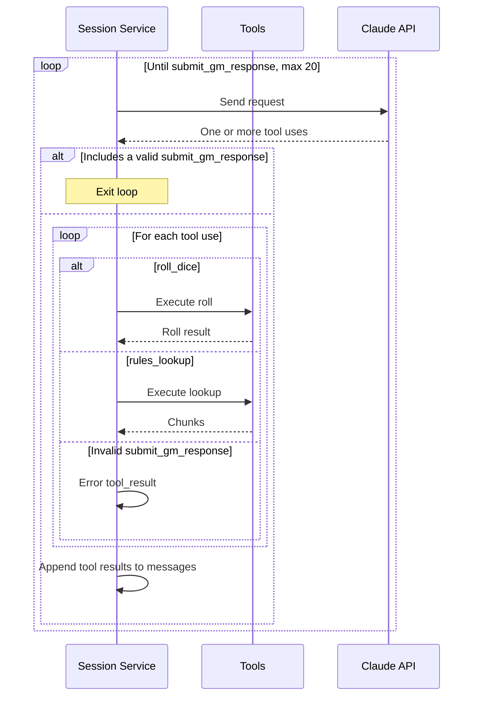

# Tool Loop and Corrections

When the session service sends its request to Claude, the request includes a list of the available tools plus a tool choice value of `{ type: 'any' }` that forces Claude to respond through one of the tools. Claude can include multiple tool calls in its response. The available tools are:

- `submit_gm_response`
- `roll_dice`
- `rules_lookup`

## Response Format

Claude makes tool calls with structured XML markup, which is then parsed by the Anthropic API into JSON data. Our API receives the JSON data and validates with Zod. If Claude makes mistakes with the closing XML tags (which it's been observed to do about 5% of the time), later fields can leak into earlier fields. Later parameters get written inside earlier parameters as plain text, so they never arrive as real fields and their state changes are lost. The schema guides Claude but doesn't constrain it today, and a strict mode exists that would constrain the structure but not what's inside the strings. See ADR-0097 for full details of our experience with this. 

## Submit GM Response

This is the tool that ends Claude's turn. If Claude calls multiple tools and `submit_gm_response` is one of them (and it passes validation), the other tool calls are ignored, the back-end processes the `submit_gm_response` call, and the turn advances to the human. The tool schema is defined in `apps/zoltar-be/src/session/session.schema.ts:234`, and I'll direct you to review the code rather than repeating it here. The schema includes fields for the text that is shown to the player, changes for the world state, notes on the Warden's reasoning, and requests for the player to roll dice. There is a field for changes to NPCs' agendas, and changes here cause the GM context block to change and need to be recached (see "[What Claude Sees](./what-claude-sees.md)").

### Correction Loop

If the tool call fails payload validation, the tool call loop continues as described below under "Loop Failures." State changes are validated against the current game state once the tool loop exits. If there is a mistake in the state changes (such as a pool doesn't exist or an entity ID was fabricated), Claude gets one chance to make a correction (see [The Correct Number of Retries is One](https://alexgs.me/posts/correct-number-of-retries-is-one)). On the correction request to Claude, `tool_choice` is set to `submit_gm_response`, which prevents Claude from rolling additional dice or performing further rules checks. The request includes the malformed response and a specific message about what went wrong. Claude has one opportunity to make corrections and call the tool again. If it fails validation the second time, the turn is aborted and an error message is displayed to the user. A parse failure or illegal tool call will also abort the turn. The user's message is saved, so they can retry without retyping.

## Roll Dice

Claude can call the `roll_dice` tool any number of times during its turn to roll dice for any purpose. Sometimes Claude will roll dice to randomly determine aspects of the game world or its narration (like many GMs do), and other times Claude will roll dice in accordance with the game rules. The tool schema is defined in `apps/zoltar-be/src/session/session.schema.ts:523`. The schema includes fields for the notation such as "1d6+2", the purpose of the roll, the acting entity, the roll type, and which earlier roll this roll depends on (such as a damage roll depending on a to-hit roll). This tool differs from the "dice requests" field in the `submit_gm_response` tool schema. This tool is for the Warden to roll dice during its turn; "dice requests" ends the Warden's turn and asks the player to roll dice.

## Rules Lookup

Claude can call the `rules_lookup` tool to search the rules corpus when it is unsure of a specific rule. The tool takes as its parameters the search query and a number of results to return (from 1 to 5, default 3). The response is an array of objects containing the matched text, its source, and a similarity score. 

## Loop Failures

An invalid call to `roll_dice` or `rules_lookup` gets an error `tool_result` and the loop continues. A response with no tool call at all throws a `SessionOutputError`. The tool call loop is limited to 20 iterations. Any iteration in excess of that throws a `SessionToolLoopError`. Both errors become HTTP errors sent to the front-end. The user's message is saved, so they can retry without retyping.
