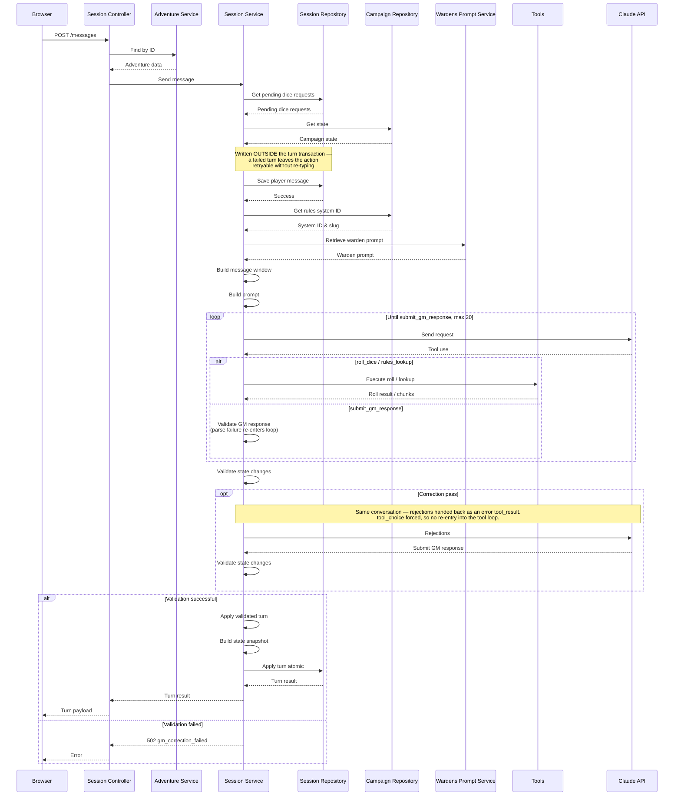

# Turn Path

How a turn works in Zoltar, end to end. 

## Sequence

- The player's message is written outside the `applyTurnAtomic` transaction so that if there's a failure, the action is retryable without forcing the player to re-enter the text.
- The correction loop is capped at one retry because multiple retries just hide failures elsewhere in the system (see [The Correct Number of Retries is One](https://alexgs.me/posts/correct-number-of-retries-is-one)). In addition, the retry cannot re-enter the tool-loop. Otherwise the retry is a superset of the initial attempt. If correction could call `roll_dice` again, a rejected state change becomes an invitation to reroll until validation passes.
- The backend owns the RNG because LLMs are not good at generating random numbers or remembering them accurately. 

## Queries inside `applyTurnAtomic`

| #  | Table                 | Op     | Condition           | Notable fields    | Depends on                                             | Source                                         |
|----|-----------------------|--------|---------------------|-------------------|--------------------------------------------------------|------------------------------------------------|
| 1  | `campaign_state`      | update | always              | `data`            |                                                        | `session.repository.ts:applyTurnAtomic`        |
| 2  | `adventure`           | select | always              | `id`              | 1 by lock-ordering convention                          | `session.events.ts:nextSequenceNumber`         |
| 3  | `game_event`          | select | always              | `sequence_number` | 2                                                      | `session.events.ts:nextSequenceNumber`         |
| 4  | `game_event`          | insert | always              | `player_action`   | 3 (base seq)                                           | `session.events.ts:writeTurnEvents`            |
| 5  | `game_event`          | insert | per system roll     | `dice_roll`       | 4 (shared `seq` counter)                               | `session.events.ts:writeTurnEvents`            |
| 6  | `game_event`          | insert | always              | `gm_response`     | 5 (shared `seq` counter)                               | `session.events.ts:writeTurnEvents`            |
| 7  | `game_event`          | insert | correction          | `correction`      | 6 (shared `seq` counter)                               | `session.events.ts:writeTurnEvents`            |
| 8  | `game_event`          | update | correction          | `supersededBy`    | 6 (target row id) + 7 (`supersededBy` value)           | `session.events.ts:writeTurnEvents`            |
| 9  | `game_event`          | insert | always              | `state_update`    | 7 (shared `seq` counter)                               | `session.events.ts:writeTurnEvents`            |
| 10 | `dice_request`        | insert | player dice rolls   |                   | 6 (`gmResponseSeq` → `issuedAtSequence`)               | `session.repository.ts:insertDiceRequests`     |
| 11 | `pending_canon`       | insert | pending canon       | `pending`         | 6 (`gmResponseSeq` → `sequenceNumber`)                 | `canon.repository.ts:insertPendingCanon`       |
| 12 | `pending_canon`       | update | auto-promote = true | `promoted`        | 11                                                     | `canon.repository.ts:autoPromoteCanon`         |
| 13 | `gm_context`          | update | always              | `blob`            |                                                        | `session.repository.ts:applyTurnAtomic`        |
| 14 | `message`             | insert | always              | `content`         |                                                        | `session.repository.ts:applyTurnAtomic`        |
| 15 | `adventure_telemetry` | insert | always              | `payload`         | 5 (`diceRollSequences`) + 6 (`gmResponseSeq` join key) | `session.telemetry.ts:writeAdventureTelemetry` |
| 16 | `adventure`           | update | status = `ready`    | `status`          | 2                                                      | `session.repository.ts:applyTurnAtomic`        |
| 17 | `game_event`          | select | always              | `gm_response`     | 6                                                      | `session.repository.ts:applyTurnAtomic`        |

- Sequence numbers are allocated once per turn (rows 3–4) and then incremented in a plain
  local counter across rows 4–9, not re-queried per row. Every event in a turn is therefore
  contiguous by construction, and a gap in `game_event.sequence_number` is not a benign
  artifact of concurrency — it means a write path outside `writeTurnEvents` allocated a number,
  or a turn partially escaped its transaction. The one legitimate interleaving is the
  `diceResult` path, which allocates its own number in a separate transaction between turns.
  Row 6's number is the hub: it is the `adventure_telemetry` join key, the `issuedAtSequence`
  on dice requests, and the canon turn stamp, so a wrong value there corrupts four tables
  consistently enough to be hard to notice.

- Two locks serialize concurrent turns, and only one of them is deliberate. Row 1's `UPDATE`
  takes an exclusive row lock on `campaign_state` (keyed by *campaign*); row 2's
  `SELECT … FOR UPDATE` takes one on `adventure` (keyed by *adventure*). Because row 1 runs
  first, sibling adventures in the same campaign serialize against each other even though they
  never contend on the adventure row — the coarser, incidental lock decides. Both are held to
  commit. Nothing enforces the ordering, so a future writer touching `campaign_state` after
  sequence allocation would introduce a deadlock; treat campaign_state-before-adventure as a
  convention. Whether the coarse lock is load-bearing depends on whether `campaign_state.data`
  is genuinely campaign-scoped — unresolved, see the M8 prerequisite.

## To Do

- The read side — precondition fetches and what `buildStateSnapshot` pulls
- Questions about transaction locks — see prerequisite for Milestone M8
